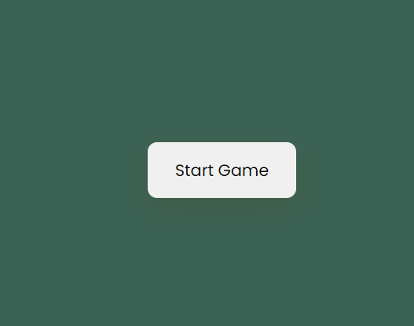
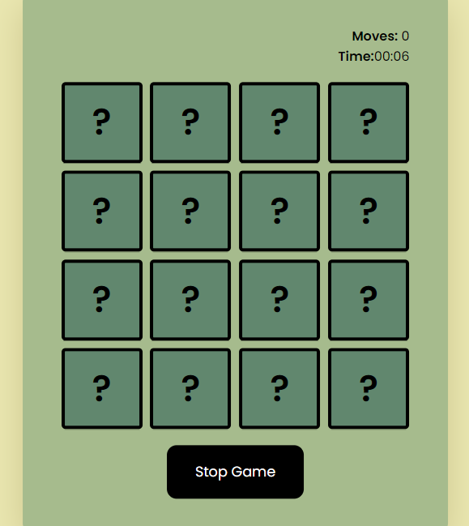
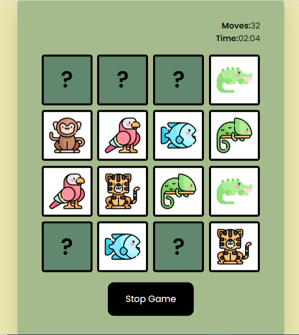

# Memory-Game

##Overview
This memory game is made using
- HTML5
- CSS3
- Vanilla JS

###Screenshot

###Links

Live URL: [click here](https://memory-game-99.netlify.app/)
Solution: [GitHub](https://github.com/ZainAsif767/Memory-Game)

## Author

- Website - [Zain Asif](www.github.com/zainasif767)
- Frontend Mentor - [@zainasif767](https://www.frontendmentor.io/profile/ZainAsif767)
- LinkedIn - [Zain Asif](https://www.linkedin.com/in/zain-asif-614337233)
